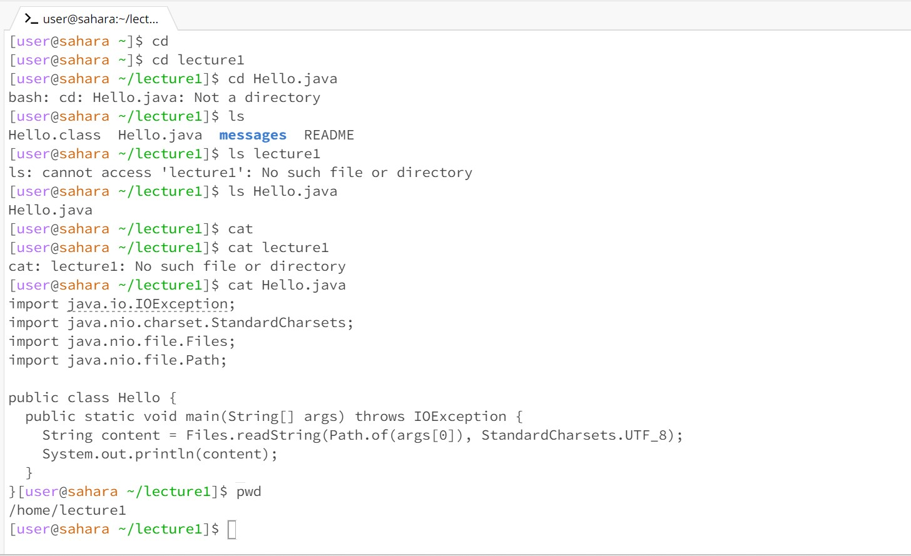

1. cd with no arguments: Not error, takes you back to the previous directory, no output
   /home was the working directory
   
2. cd lecture1: Not error, sets the current directory to lecture1, no output
   /home was the working directory
   
3. cd Hello.java: Error, because Hello.java is not a directory
   /home/lecture1 was the working directory
   
4. ls with no arguments: Not error, lists files in the current directory
   /home/lecture1 was the working directory
   
5. ls lecture1: Error, because lecture 1 is already the working directory,
   and there does not exist another lecture 1 directory within
   /home/lecture1 was the working directory
   
6. ls Hello.java: Not error, displays information about the Hello.java file
   /home/lecture1 was the working directory

7. cat with no arguments: Not error, nothing happened, must either use keyboard input or ctrl+d
   to end file or it reads from standard input
   /home/lecture1 was the working directory

8. cat lecture1: Error, cat is used to read a file and write it to standard output, not for a directory
   /home/lecture1 was the working directory

9. cat Hello.java: Not error, printed out the contects of the java file to standard output
    /home/lecture1 was the working directory
